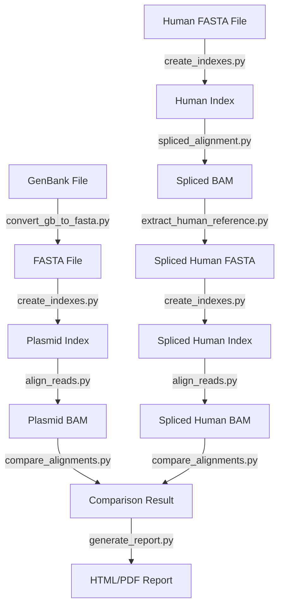

# plasmicheck

plasmicheck: Detect and quantify plasmid DNA contamination in sequencing data.

## Installation

You can install plasmicheck using pip:

```bash
pip install .
```

### Required Packages

Make sure you have the following packages installed:

- `biopython`
- `pysam`
- `jinja2`
- `weasyprint`
- `matplotlib`
- `seaborn`
- `pandas`

You can install them using pip:

```bash
pip install biopython pysam jinja2 weasyprint matplotlib seaborn pandas
```

## Usage

plasmicheck provides a command-line interface with the following commands:

- `convert`: Convert GenBank files to FASTA format.
- `index`: Create Minimap2 and Samtools indexes for a FASTA file.
- `align`: Align reads to plasmid and human references.
- `compare`: Compare alignments and assign reads.
- `spliced`: Perform spliced alignment and extract human reference regions.
- `pipeline`: Run the full pipeline to detect and quantify plasmid DNA contamination in sequencing data.
- `report`: Generate a visualized HTML/PDF report from alignment comparison results.

### Convert GenBank Files to FASTA

```bash
plasmicheck convert <input_file> <output_file> [--shift_bases <shift_bases>] [--generate_shifted] [--overwrite]
```

- `<input_file>`: Input GenBank file.
- `<output_file>`: Output FASTA file.
- `--shift_bases`: Number of bases to shift in the shifted reference (default: 500).
- `--generate_shifted`: Generate a shifted reference sequence.
- `--overwrite`: Overwrite existing output file.

### Create Minimap2 and Samtools Indexes for a FASTA File

```bash
plasmicheck index <fasta_file> [--overwrite]
```

- `<fasta_file>`: FASTA file to index.
- `--overwrite`: Overwrite existing index files.

### Align Reads to References

```bash
plasmicheck align <reference_index> <input_file> <output_bam> <alignment_type> <file_type> [--fastq2 <fastq2>]
```

- `<reference_index>`: Minimap2 index for the reference genome.
- `<input_file>`: Input file (BAM, interleaved FASTQ, or first FASTQ file for paired FASTQ).
- `<output_bam>`: Output BAM file for alignment.
- `<alignment_type>`: Type of alignment: 'human' or 'plasmid'.
- `<file_type>`: Type of input file: 'bam', 'interleaved_fastq', or 'paired_fastq'.
- `--fastq2`: Second FASTQ file for paired FASTQ input.

### Compare Alignments and Assign Reads

```bash
plasmicheck compare <plasmid_bam> <human_bam> <output_basename>
```

- `<plasmid_bam>`: BAM file for plasmid alignment.
- `<human_bam>`: BAM file for human alignment.
- `<output_basename>`: Basename for output files.

### Perform Spliced Alignment and Extract Human Reference Regions

```bash
plasmicheck spliced <output_fasta> <human_index> <plasmid_fasta> <output_bam> [--human_fasta <human_fasta>] [--padding <padding>]
```

- `<output_fasta>`: Output FASTA file for the extracted human reference regions.
- `<human_index>`: Minimap2 index for the human reference genome.
- `<plasmid_fasta>`: FASTA file of the plasmid reference.
- `<output_bam>`: Output BAM file for the spliced alignment.
- `--human_fasta`: FASTA file of the human reference genome (optional).
- `--padding`: Padding to add to both sides of the spanned regions (default: 1000).

### Run the Full Pipeline

```bash
plasmicheck pipeline <human_fasta> <plasmid_gb> <sequencing_file> <output_folder> <file_type> [--fastq2 <fastq2>] [--keep_intermediate] [--shift_bases <shift_bases>] [--generate_shifted] [--overwrite] [--padding <padding>] [--threshold <threshold>]
```

- `<human_fasta>`: Human reference FASTA file.
- `<plasmid_gb>`: GenBank plasmid file.
- `<sequencing_file>`: Sequencing file (BAM, interleaved FASTQ, or first FASTQ file for paired FASTQ).
- `<output_folder>`: Folder to write all outputs and intermediate files.
- `<file_type>`: Type of input file: 'bam', 'interleaved_fastq', or 'paired_fastq'.
- `--fastq2`: Second FASTQ file for paired FASTQ input (optional).
- `--keep_intermediate`: Keep intermediate files (default: delete them).
- `--shift_bases`: Number of bases to shift in the shifted reference (default: 500).
- `--generate_shifted`: Generate a shifted reference sequence.
- `--overwrite`: Overwrite existing output files.
- `--padding`: Padding to add to both sides of the spanned regions (default: 1000).
- `--threshold`: Threshold for contamination verdict (default: 1.0).

### Generate a Report

```bash
plasmicheck report <reads_assignment_file> <summary_file> <output_folder> [--threshold <threshold>]
```

- `<reads_assignment_file>`: Reads assignment file (reads_assignment.tsv).
- `<summary_file>`: Summary file (summary.tsv).
- `<output_folder>`: Folder to write the report and plots.
- `--threshold`: Threshold for contamination verdict (default: 1.0).

### Example Usage

Here is an example workflow using plasmicheck:

1. **Convert GenBank files to FASTA**:
    ```bash
    plasmicheck convert ./genbank_files/plasmid.gb ./fasta_files/plasmid.fasta
    ```

2. **Create Minimap2 and Samtools indexes**:
    ```bash
    plasmicheck index ./fasta_files/plasmid.fasta --overwrite
    plasmicheck index ./fasta_files/human.fasta --overwrite
    ```

3. **Align reads to plasmid and human references**:
    ```bash
    plasmicheck align ./indexes/plasmid_index.mmi ./indexes/human_index.mmi ./reads/sample_R1.fastq.gz ./reads/sample_R2.fastq.gz ./alignments/plasmid_aligned.bam ./alignments/human_aligned.bam
    ```

4. **Compare alignments and assign reads**:
    ```bash
    plasmicheck compare ./alignments/plasmid_aligned.bam ./alignments/human_aligned.bam ./results/read_assignments
    ```

5. **Run the full pipeline**:
    ```bash
    plasmicheck pipeline ./reference/GRCh38/GCA_000001405.15_GRCh38_no_alt_analysis_set.fna ./reference/plasmid/pcdna5_cacna1h_genbank.gb ./data/APA19-N.merged.dedup.bqsr.apa-genes.bam ./output/ bam --threshold 1.0
    ```

6. **Generate a report**:
    ```bash
    plasmicheck report ./output/APA19-N.merged.dedup.bqsr.apa-genes/pcdna5_cacna1h_genbank/comparison_result.reads_assignment.tsv ./output/APA19-N.merged.dedup.bqsr.apa-genes/pcdna5_cacna1h_genbank/comparison_result.summary.tsv ./output/
    ```

### Pipeline Diagram



## License

This project is licensed under the MIT License.
