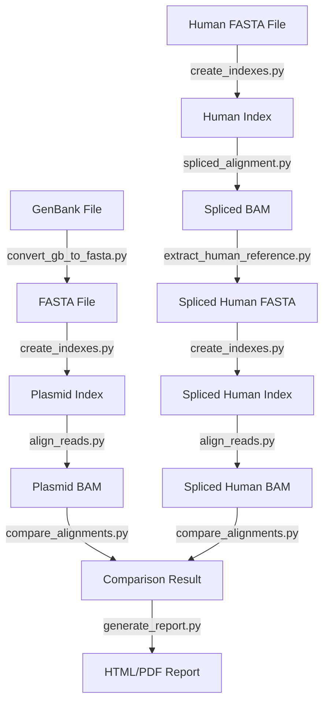

### plasmicheck: Detect and quantify plasmid DNA contamination in sequencing data


'plasmicheck' is a comprehensive tool for detecting and quantifying plasmid DNA contamination in sequencing data. It provides a fully integrated pipeline for handling all steps, even with large batches of sequencing files and plasmid inputs. The tool is efficient and easy to use, and it automates all necessary processes, from initial data conversion to final report generation.

### Logic and Key Steps

The core logic of `plasmicheck` revolves around three key steps:

1. **Spliced Alignment**: To accurately detect plasmid contamination, 'plasmicheck' uses a spliced alignment in which the cDNA insert (representing spliced mRNA) is mapped against the human genome. This step determines which human genomic regions correspond to the cDNA insert, resulting in a plasmid-specific human reference sequence. This approach is agnostic to the plasmid reference and requires no additional knowledge about the gene cloned into the plasmid, making it widely applicable.

2. **Read Alignment**: The sequencing reads are aligned to both the plasmid reference and a plasmid-specific human reference generated by spliced alignment. This alignment step is critical for determining where the reads map, which serves as the foundation for contaminant detection.

3. **Alignment Comparison**: After the reads have been aligned to both references, the tool compares the alignments to see if there are more reads aligned to the plasmid reference than the human reference. Performing this comparison is crucial for detecting the presence of plasmid DNA contamination, as a greater degree of alignment with the plasmid indicates the presence of contamination.

### Additional Functionality and Conversion Steps

Beyond its core logic, 'plasmicheck' offers a comprehensive set of functionalities aimed at streamlining the entire contamination detection process, even when dealing with multiple sequencing files and plasmid inputs. The tool provides complete pipeline integration, automating every step from raw data to final reports, resulting in a smooth and efficient workflow.

1. **Plasmid File Conversion**: `plasmicheck` supports the conversion of plasmid sequences from GenBank / xDNA format to FASTA, facilitating compatibility with alignment tools.

2. **Indexing**: To accelerate the alignment process, `plasmicheck` automatically generates indices for both plasmid and human reference sequences using `minimap2` and `samtools`.

3. **Report Generation**: After comparing the alignments, `plasmicheck` generates a detailed report summarizing the results. This report includes contamination verdicts, read assignments, and visual representations such as boxplots and dotplots.

4. **Summary Reports**: For users working with multiple samples, `plasmicheck` can generate summary reports that aggregate results across different plasmids and sequencing files. The heatmap plots and tabular representations help users visualize the extent of contamination across different samples and plasmids, making it easier to interpret the results.

## Installation

### Option 1: Using pip

You can install plasmicheck using pip:

```bash
pip install .
```

### Option 2: Using Conda Environment

Alternatively, you can set up a Conda environment using the provided `plasmicheck_full_conda.yml` file (which includes all dependencies) as follows:

1. Clone the repository:

    ```bash
    git clone https://github.com/berntpopp/plasmicheck.git
    cd plasmicheck
    ```

2. Create the Conda environment:

    ```bash
    conda env create -f conda/conda/plasmicheck_full_conda.yml
    ```

3. Activate the environment:

    ```bash
    conda activate plasmicheck
    ```

### Required Tools and Python Packages

Make sure you have the following tools and packages installed:

- **Tools:**
  - `minimap2` (version >= 2.17-r941)
  - `samtools` (version >= 1.13)

- **Python Packages:**
  - `biopython` (version 1.84)
  - `pysam` (version 0.22.1)
  - `jinja2` (version 3.0.0)
  - `matplotlib` (version 3.9.1)
  - `seaborn` (version 0.13.2)
  - `pandas` (version 2.2.2)
  - `scipy` (version 1.13.1)
  - `plotly` (version 5.23.0)
  - `statsmodels` (version 0.14.2)
  - `numpy` (version 2.0.1)

You can also install the Python packages using pip:

```bash
pip install biopython pysam jinja2 weasyprint matplotlib seaborn pandas scipy plotly statsmodels numpy
```


## Configuration

The tool uses a `config.json` file for various settings, including the number of threads to use for `minimap2` and `samtools`. Below is an example configuration snippet:

```json
{
  "alignment": {
    "minimap2_threads": 8,
    "samtools_threads": 4
  },
  "indexing": {
    "minimap2_options": ["-d"],
    "samtools_options": []
  },
  ...
}
```

- **`minimap2_threads`**: Number of threads to use for `minimap2`.
- **`samtools_threads`**: Number of threads to use for `samtools` commands that support threading.

## Usage

plasmicheck provides a command-line interface with the following commands:

- `convert`: Convert GenBank files to FASTA format.
- `index`: Create Minimap2 and Samtools indexes for a FASTA file.
- `align`: Align reads to plasmid and human references.
- `compare`: Compare alignments and assign reads.
- `spliced`: Perform spliced alignment and extract human reference regions.
- `pipeline`: Run the full pipeline to detect and quantify plasmid DNA contamination in sequencing data.
- `report`: Generate a visualized HTML/PDF report from alignment comparison results.
- `summary_reports`: Generate summary reports for multiple samples and plasmids.

### Run the Full Pipeline

```bash
plasmicheck pipeline <human_fasta> <plasmid_files> <sequencing_files> <output_folder> [--keep_intermediate] [--shift_bases <shift_bases>] [--generate_shifted] [--overwrite] [--padding <padding>] [--threshold <threshold>]
```

- `<human_fasta>`: Human reference FASTA file.
- `<plasmid_files>`: Plasmid files (single file or a file containing paths to multiple files).
- `<sequencing_files>`: Sequencing files (single file or a file containing paths to multiple files).
- `<output_folder>`: Folder to write all outputs and intermediate files.
- `--keep_intermediate`: Keep intermediate files (default: delete them).
- `--shift_bases`: Number of bases to shift in the shifted reference (default: 500).
- `--generate_shifted`: Generate a shifted reference sequence.
- `--overwrite`: Overwrite existing output files.
- `--padding`: Padding to add to both sides of the spanned regions (default: 1000).
- `--threshold`: Threshold for contamination verdict (default: 0.8).

### Convert GenBank Files to FASTA

```bash
plasmicheck convert <input_file> <output_file> [--shift_bases <shift_bases>] [--generate_shifted] [--overwrite]
```

- `<input_file>`: Input GenBank file.
- `<output_file>`: Output FASTA file.
- `--shift_bases`: Number of bases to shift in the shifted reference (default: 500).
- `--generate_shifted`: Generate a shifted reference sequence.
- `--overwrite`: Overwrite existing output file.

### Create Minimap2 and Samtools Indexes for a FASTA File

```bash
plasmicheck index <fasta_file> [--overwrite]
```

- `<fasta_file>`: FASTA file to index.
- `--overwrite`: Overwrite existing index files.

### Align Reads to References

```bash
plasmicheck align <reference_index> <input_file> <output_bam> <alignment_type> [--fastq2 <fastq2>]
```

- `<reference_index>`: Minimap2 index for the reference genome.
- `<input_file>`: Input file (BAM, interleaved FASTQ, or first FASTQ file for paired FASTQ).
- `<output_bam>`: Output BAM file for alignment.
- `<alignment_type>`: Type of alignment: 'human' or 'plasmid'.
- `--fastq2`: Second FASTQ file for paired FASTQ input.

### Compare Alignments and Assign Reads

```bash
plasmicheck compare <plasmid_bam> <human_bam> <output_basename> [--threshold <threshold>]
```

- `<plasmid_bam>`: BAM file for plasmid alignment.
- `<human_bam>`: BAM file for human alignment.
- `<output_basename>`: Basename for output files.
- `--threshold`: Threshold for contamination verdict (default: 0.8).

### Perform Spliced Alignment and Extract Human Reference Regions

```bash
plasmicheck spliced <output_fasta> <human_index> <plasmid_fasta> <output_bam> [--human_fasta <human_fasta>] [--padding <padding>]
```

- `<output_fasta>`: Output FASTA file for the extracted human reference regions.
- `<human_index>`: Minimap2 index for the human reference genome.
- `<plasmid_fasta>`: FASTA file of the plasmid reference.
- `<output_bam>`: Output BAM file for the spliced alignment.
- `--human_fasta`: FASTA file of the human reference genome (optional).
- `--padding`: Padding to add to both sides of the spanned regions (default: 1000).

### Generate a Report

```bash
plasmicheck report <reads_assignment_file> <summary_file> <output_folder> [--threshold <threshold>]
```

- `<reads_assignment_file>`: Reads assignment file (reads_assignment.tsv).
- `<summary_file>`: Summary file (summary.tsv).
- `<output_folder>`: Folder to write the report and plots.
- `--threshold`: Threshold for contamination verdict (default: 0.8).

### Generate Summary Reports for Multiple Samples and Plasmids

```bash
plasmicheck summary_reports -i <input_dir> -o <output_dir> [--threshold <threshold>]
```

- `<input_dir>`: Directory containing the compare outputs.
- `<output_dir>`: Directory to save the plots and reports.
- `--threshold`: Threshold for contamination verdict (default: 0.8).

### Example Usage

Here is an example workflow using plasmicheck:

1. **Convert GenBank files to FASTA**:
    ```bash
    plasmicheck convert ./genbank_files/plasmid.gb ./fasta_files/plasmid.fasta
    ```

2. **Create Minimap2 and Samtools indexes**:
    ```bash
    plasmicheck index ./fasta_files/plasmid.fasta --overwrite
    plasmicheck index ./fasta_files/human.fasta --overwrite
    ```

3. **Align reads to plasmid and human references**:
    ```bash
    plasmicheck align ./indexes/plasmid_index.mmi ./indexes/human_index.mmi ./reads/sample_R1.fastq.gz ./reads/sample_R2.fastq.gz ./alignments/plasmid_aligned.bam ./alignments/human_aligned.bam
    ```

4. **Compare alignments and assign reads**:
    ```bash
    plasmicheck compare ./alignments/plasmid_aligned.bam ./alignments/human_aligned.bam ./results/read_assignments
    ```

5. **Run the full pipeline**:
    ```bash
    plasmicheck pipeline ./reference/GRCh38/GCA_000001405.15_GRCh38_no_alt_analysis_set.fna ./reference/plasmid/pcdna5_cacna1h_genbank.gb ./data/APA19-N.merged.dedup.bqsr.apa-genes.bam ./output/ --threshold 0.8
    ```

6. **Generate a report**:
    ```bash
    plasmicheck report ./output/APA19-N.merged.dedup.bqsr.apa-genes/pcdna5_cacna1h_genbank/comparison_result.reads_assignment.tsv ./output/APA19-N.merged.dedup.bqsr.apa-genes/pcdna5_cacna1h_genbank/comparison_result.summary.tsv ./output/
    ```

7. **Generate summary reports**:
    ```bash
    plasmicheck summary_reports -i ./output/ -o ./summary/ --threshold 0.8
    ```

### Pipeline Diagram



## License

This project is licensed under the MIT License.
